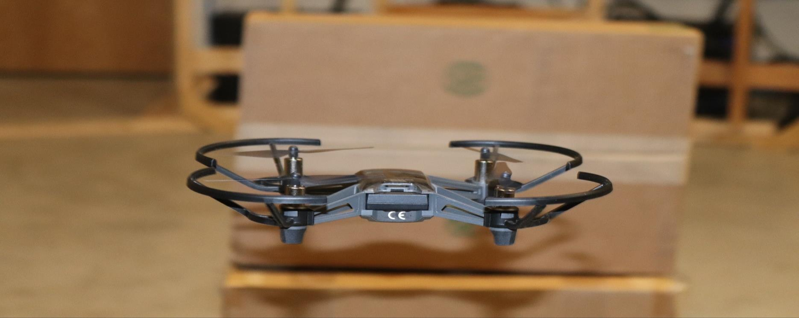

# Object Detection and Tracking with Autonomous Drones



This repo contains code for the project of drone object detection for the course CS 670 Advanced Topics of Deep Learning at Clarkson University, Spring 2022. More introduction to the project is on the [project website](https://xinchaosong.com/CS670_SP2022_Drone/).

## Installation

### Linux Dependencies

```shell
$ sudo apt install build-essential cmake libswscale-dev libavcodec-dev libavutil-dev python3.7-dev python3.7-venv
```

### Python Dependencies

- Python >= 3.7
- TensorFlow
- PyTorch
- PyBullet
- [requirements.txt](requirements.txt)
- Python H264 decoder: <https://github.com/DaWelter/h264decoder>

### Installation

Create and activate the Python virtual environment

```shell
$ python -m venv ./venv/cs670
$ source ./venv/cs670/bin/activate
```

Install the Python libraries

```shell
$ pip install --upgrade pip
$ pip install -r requirements.txt
```

Install the H264 decoder

```shell
$ cd h264decoder
$ pip install .
```

## Run

Activate the Python virtual environment

```shell
$ source ./venv/cs670/bin/activate
```

### Simple Tests

Run the test code for the drone flight:

```shell
$ python tello_flight_test.py
```

Run the flight test code for Model S:

```shell
$ python model_s_test.py
```

Run the flight test code for Model J:

```shell
$ python model_j_test.py
```

Run the pybullet demo for the box recognition:

```shell
$ python pybullet_box_recognition_demo.py
```

Run the pybullet demo for the deap learning environment:

```shell
$ python pybullet_env_demo.py
```

### Train Model J:

- Scripts: ./model_j
- Data: [Google Drive](https://drive.google.com/drive/folders/1v1jTYHFk4dlJ9eMyPy2gGVP3OXyr0DeP?usp=sharing)

### Train Model S:

- Scripts: ./model_s
- Data: [Google Drive](https://drive.google.com/drive/folders/1v1jTYHFk4dlJ9eMyPy2gGVP3OXyr0DeP?usp=sharing)

### Train the Reinforcement Learning Model:

Train the A2C reinforcement learning model:

```shell
python main.py --env-name "DroneBulletEnv-v0"
```

The pretrained models are in `./trained_models/a2c`. If you retrain the model, then before running the following demos, 
you may need to make copies of the model file `DroneBulletEnv-v0.pt` and rename them to `DroneRenderEnv-v0.pt` and `DroneTelloEnv-v0`, respectively.

### Demos

Pybullet demo:

```shell
python enjoy.py --load-dir trained_models/a2c --env-name "DroneRenderEnv-v0"
```

Tello drone flight demo:

```shell
python enjoy.py --load-dir trained_models/a2c --env-name "DroneTelloEnv-v0"
```

## Reference

- R. Girshick, J. Donahue, T. Darrell, and J. Malik, "Region-Based Convolutional Networks for Accurate Object Detection and Segmentation," in IEEE Transactions on Pattern Analysis and Machine Intelligence, vol. 38, no. 1, pp. 142-158, 1 Jan. 2016, doi: 10.1109/TPAMI.2015.2437384.
- J. Zhu, Y. Fang, H. Abu-Haimed, K. Lien, D. Fu, and J. Gu.  (2019). Learning Object-Specific Distance From a Monocular Image. 2019 IEEE/CVF International Conference on Computer Vision (ICCV), 3838-3847.
- J. R. Uijlings, K. E. Sande, T. Gevers, and A. W. Smeulders. 2013. Selective Search for Object Recognition. Int. J. Comput. Vision 104, 2 (September 2013), 154–171. https://doi.org/10.1007/s11263-013-0620-5
- [Tello-Python](https://github.com/dji-sdk/Tello-Python)
- [pytorch-a2c-ppo-acktr](https://github.com/ikostrikov/pytorch-a2c-ppo-acktr-gail)
