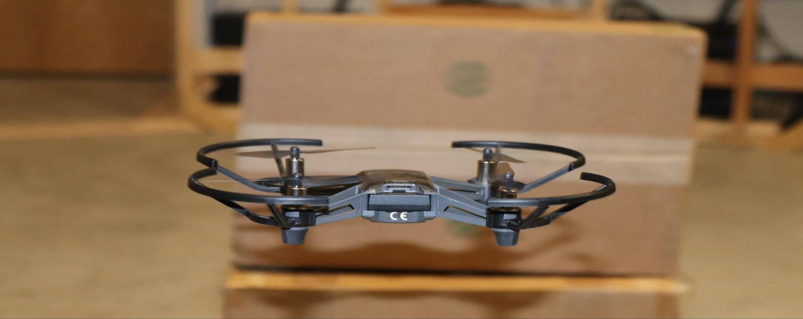
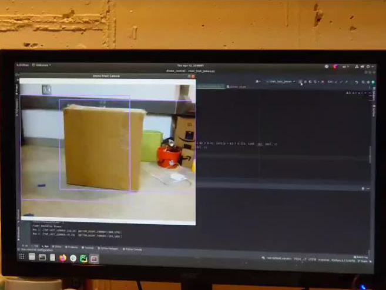
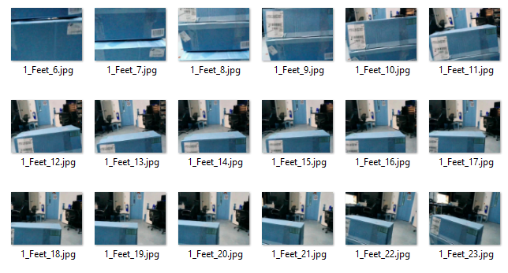
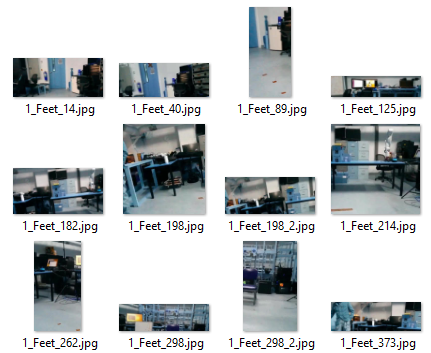
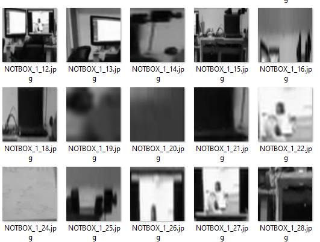
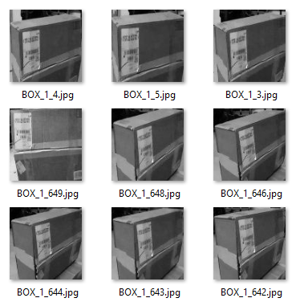
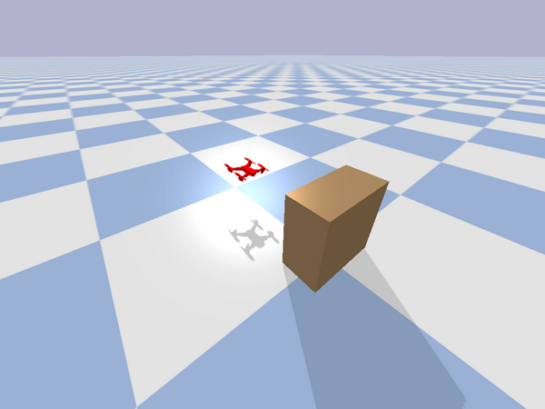
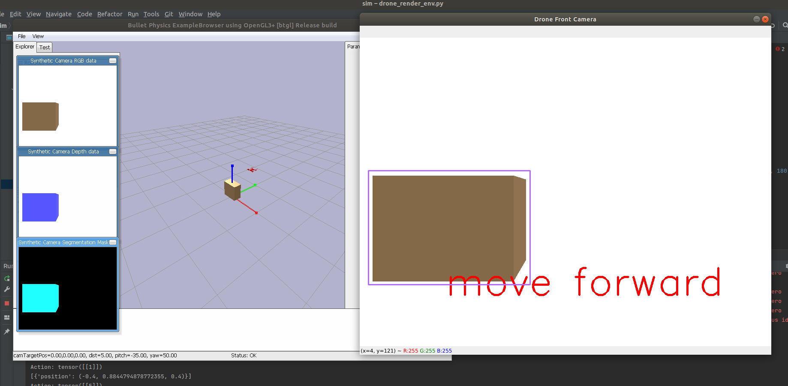
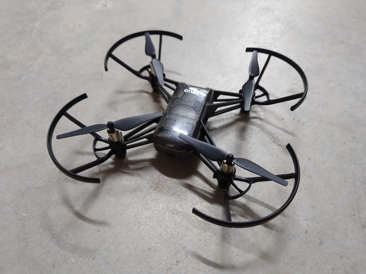

# Object Detection and Tracking with An Autonomous Drone

## Introduction

Object detection and tracking is a safety feature for Drone that provides the security and safety to drone collusion. The feature enables drones to scan the environment and detect any obstacle along their route in real-time. Once Drone detects the obstacle, it reacts immediately by avoiding it. This robotic feature is especially important in smaller drones since they don’t fly very high, and therefore they are at a higher risk of finding obstacles in their path. However, even many larger ones need this feature as well. With obstacle avoidance technology, drones will fly safely, and it can fly with confidence. One of the main elements of obstacle avoidance technology is precision. It enables the drone to detect an obstacle from a few centimeters away and doesn’t require GPS to be aware of its surroundings. This means that the drone is provided with some positioning information even when it’s operating at high speed.

In this project, to show the core concepts in the simplest way, we will just let the drone to detect and track a box. However, the ideas and methods can be easily extended to more complicated objects and environment.

This project is for the course CS 670 Advanced Topics of Deep Learning at Clarkson University, Spring 2022. The code and documentation can be found in our [GitHub repo](https://github.com/xinchaosong/CS670_SP2022_Drone).

## Working Pipeline

The basic working pipeline is:

1. The drone takes off and starts streaming.
2. The indirect model (Model J) detects the box and generates the information of the target box (position, dimension, etc.).
3. The reinforcement learning model uses the information in step (2) to give proper commands to the drone.
4. The drone flies follows the commands from step (3) until it flies to a position center to the target box.
5. The drone lands safely.

## Indirect Model (Model J)

### Data Preparation for Training

1. Video clips were parsed into individual images that were sparsely chosen as every 5th frame (to minimize space taken on hard drive).

2. Certain images were selected from all data. The images selected from all data were:
   1. Ones that exhibited a significant area of background.
   2. Ones that showed many angles of the room.
   3. Cropped to exclude all instances of boxes, so that what remains is ONLY the background.

3. Using the images from step (2), each image was:
   1. Resized to 30% of its original size.
   2. Input to a selective search algorithm (on "Quality" mode to find as many different regions as possible).
   3. Each of the regions is representative of a background object found using a clustering method inherent to selective search.

4. Each of the images from step (3) was:
   1. resized to 100x100 pixels.
   2. gray-scaled
   3. At this point, this is the training set - Label = "NOT BOX"
   

5. Using all data from step (1), each image was:
   1. Resized to 30% of its original size.
   2. Boxes were manually cropped (many, many hours) and the distance from the box was preserved
   3. cropped images

6. Using images from step (5), each image was:
   1. Resized to 100x100 pixels
   2. gray-scaled
   3. At this point this is the training set - Label = "BOX"

### Model Architecture

- Architecture is CNN. 
- Training and testing accuracy are based on data set described from step (4 and 6). 

## Reinforcement Learning

- Use PyBullet and gym to create the simulation environment.
- Use the Advantage Actor Critic (A2C) algorithm to train the agent.

## Direct Model (Model S)

- Directly predict flight commands based on ever frame from the video streaming
- The model is trained using video data.
- The model is much more challenging and we have not yet obtained a good trained model with a decent accuracy in the time frame of this project.

## Experiments

We use a Tello EDU drone as the experimental platform, which is shown below. Tello EDU is a lightweight mini quadcopter that is especially good for indoor flight. It is equipped with an Intel 14-core processor, a high-quality camera that supports 720P video recording and streaming, and several positioning and protective features. It can be remotely controlled through Wi-Fi or Bluetooth from its official mobile application, a GUI program on PC, or scripts using the built-in Python APIs.

## Reference

- R. Girshick, J. Donahue, T. Darrell, and J. Malik, "Region-Based Convolutional Networks for Accurate Object Detection and Segmentation," in IEEE Transactions on Pattern Analysis and Machine Intelligence, vol. 38, no. 1, pp. 142-158, 1 Jan. 2016, doi: 10.1109/TPAMI.2015.2437384.
- J. Zhu, Y. Fang, H. Abu-Haimed, K. Lien, D. Fu, and J. Gu.  (2019). Learning Object-Specific Distance From a Monocular Image. 2019 IEEE/CVF International Conference on Computer Vision (ICCV), 3838-3847.
- J. R. Uijlings, K. E. Sande, T. Gevers, and A. W. Smeulders. 2013. Selective Search for Object Recognition. Int. J. Comput. Vision 104, 2 (September 2013), 154–171. https://doi.org/10.1007/s11263-013-0620-5
- [Tello-Python](https://github.com/dji-sdk/Tello-Python)
- [pytorch-a2c-ppo-acktr](https://github.com/ikostrikov/pytorch-a2c-ppo-acktr-gail)
